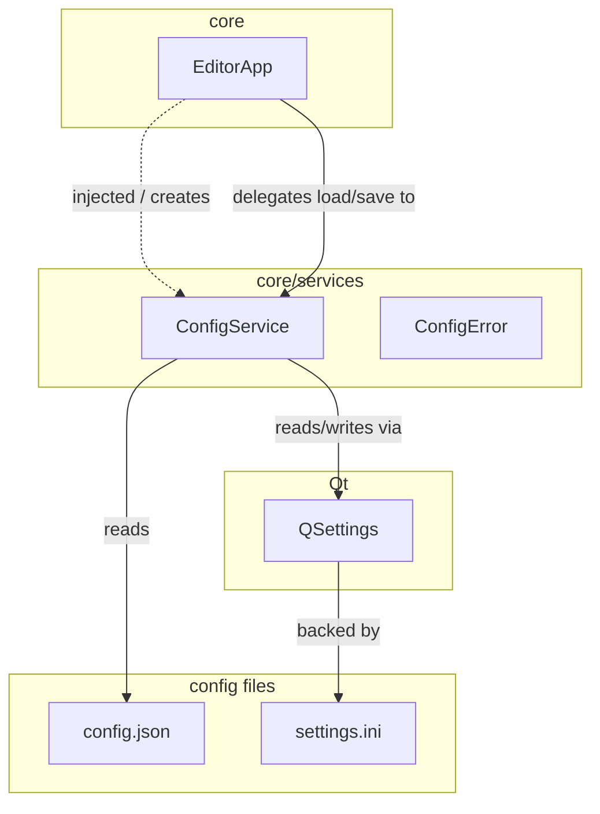

**Пояснение:**
- `ConfigService` — plain class, не Qt
- `ConfigError` — исключение (наследует `Exception`)
- `injected / creates` — EditorApp получает ConfigService через конструктор либо создаёт сам
- `delegates` — EditorApp вызывает `load_config()`, `restore_settings()`, `closeEvent()` → ConfigService
