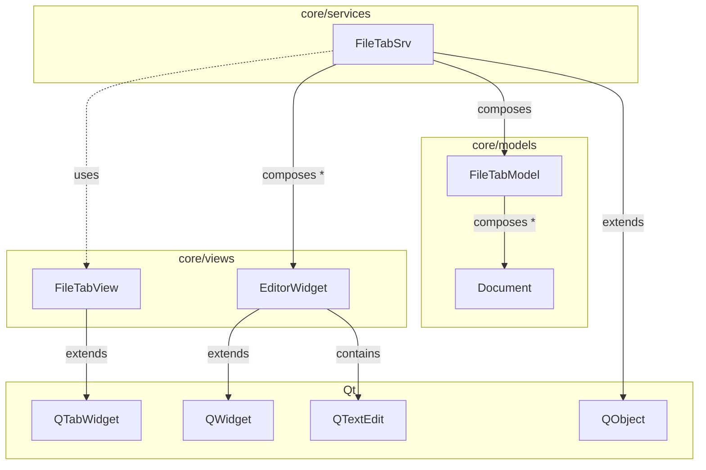

**Пояснение стрелок:**
- `extends` — наследование от Qt-класса
- `composes` — композиция (создаёт и владеет объектом)
- `composes *` — композиция со списком (1 ко многим)
- `uses` — получает ссылку через параметр конструктора
