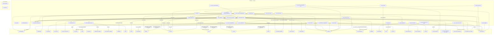

```mermaid
graph TD

  subgraph FileTabSrv["FileTabSrv — методы"]
    init["__init__(view, editor_class)"]
    new_tab["new_tab()"]
    add_tab["add_tab(path=None)"]
    close_tab["close_tab(index, close_last_tab=False)"]
    close_all["close_all_tab()"]
    closeEvent["closeEvent(event)"]
    remove_tab["_remove_tab(index)"]
    load_file["_load_file(doc, ew)"]
    check_path["_check_path_exists(path)"]
    create_widget["_create_widget(document)"]
    save_tab["_save_tab(index)"]
    save_as_tab["_save_as_tab(index)"]
    reload_tab["_reload_tab(index, ew)"]
    cur_save["current_tab_save()"]
    cur_save_as["current_tab_save_as()"]
    cur_close["current_tab_close()"]
    cur_reload["current_tab_reload()"]
    cur_prop["current_tab_view_property()"]
    open_file["open_file()"]
    get_open["get_open_files()"]
    set_files["set_files(file_list)"]
    on_close["_on_close_requested(index)"]
    on_tab_moved["_on_tab_moved(from_idx, to_idx)"]
    on_cur_chg["_on_current_changed(index)"]
    on_mod_chg["_on_modification_changed(doc)"]
    cur_editor["current_editor()"]
    cur_widget["current_widget()"]
    cur_doc["current_document()"]
    tab_cnt["tab_count()"]
    on_focus["on_app_focus_changed(old, now)"]
    check_ext["_check_external_modified(index)"]
  end

  subgraph FileTabView["FileTabView (core/views)"]
    FTV_setCurrentIndex["setCurrentIndex(i)"]
    FTV_add_editor_tab["add_editor_tab(widget, title, tooltip)"]
    FTV_remove_editor_tab["remove_editor_tab(index)"]
    FTV_set_tab["set_tab(index, text, tooltip)"]
    FTV_currentIndex["currentIndex()"]
  end

  subgraph FileTabModel["FileTabModel (core/models)"]
    FTM_index_of["index_of(path)"]
    FTM_at["at(index)"]
    FTM_set_current["set_current(index)"]
    FTM_add["add(path)"]
    FTM_remove["remove(index)"]
    FTM_count["count"]
    FTM_all_docs["all_docs()"]
    FTM_move_doc["move_doc(from, to)"]
    FTM_index_of_doc["index_of_doc(doc)"]
    FTM_current["current()"]
  end

  subgraph Document["Document (core/models)"]
    D_bind["bind(qdoc)"]
    D_load["load()"]
    D_save["save()"]
    D_save_as["save_as(path)"]
    D_modified["modified"]
    D_file_path["file_path"]
    D_title["title"]
    D_full_title["full_title"]
    D_content["content"]
    D_is_ext_mod["is_externally_modified()"]
    D_last_mtime["last_file_mtime"]
  end

  subgraph EditorWidget["EditorWidget (core/views)"]
    EW_set_text["set_text(text)"]
    EW_text_cursor["text_cursor()"]
    EW_set_text_cursor["set_text_cursor(cursor)"]
    EW_set_focus["set_focus()"]
    EW_editor["editor"]
    EW_document["document()"]
    EW_mod_chg["modification_changed"]
    EW_cursor_chg["cursor_position_changed"]
  end

  subgraph QtWdg["Qt / QTabWidget"]
    QT_setCurrentIndex["setCurrentIndex"]
    QT_currentIndex["currentIndex"]
  end

  subgraph QtDlg["Qt — диалоги"]
    QMsgBox["QMessageBox"]
    QFileDlg["QFileDialog"]
  end

  %% init
  init -->|"connects"| FTV_currentIndex
  init -->|"connects"| FTV_setCurrentIndex

  %% add_tab
  add_tab --> FTM_index_of
  add_tab --> FTM_at
  add_tab --> FTM_set_current
  add_tab --> FTM_add
  add_tab --> check_path
  add_tab --> create_widget
  add_tab -->|"doc.bind(ew.document())"| D_bind
  add_tab -->|"doc.title / doc.full_title"| D_title
  add_tab -->|"doc.title / doc.full_title"| D_full_title
  add_tab --> load_file
  add_tab --> FTV_setCurrentIndex
  add_tab --> FTV_add_editor_tab

  %% create_widget
  create_widget -->|"создаёт"| EW_set_focus
  create_widget -->|"connects"| EW_mod_chg
  create_widget -->|"connects"| EW_cursor_chg

  %% load_file
  load_file --> D_load
  load_file --> EW_set_text

  %% close_tab
  close_tab --> FTM_at
  close_tab -->|"doc.modified"| D_modified
  close_tab -->|"doc.file_path"| D_file_path
  close_tab -->|"doc.is_externally_modified()"| D_is_ext_mod
  close_tab --> QMsgBox
  close_tab --> save_tab
  close_tab --> remove_tab

  %% remove_tab
  remove_tab --> FTM_remove
  remove_tab --> FTV_remove_editor_tab

  %% close_all_tab
  close_all -->|"self._model.count"| FTM_count
  close_all --> FTV_setCurrentIndex
  close_all --> close_tab

  %% _save_tab
  save_tab --> FTM_at
  save_tab -->|"doc.file_path"| D_file_path
  save_tab --> check_path
  save_tab -->|"doc.save()"| D_save
  save_tab --> save_as_tab
  save_tab --> FTV_set_tab

  %% _save_as_tab
  save_as_tab --> QFileDlg
  save_as_tab --> FTM_at
  save_as_tab -->|"doc.save_as(path)"| D_save_as
  save_as_tab --> FTV_set_tab

  %% _reload_tab
  reload_tab --> FTM_at
  reload_tab -->|"doc.file_path"| D_file_path
  reload_tab --> check_path
  reload_tab --> EW_text_cursor
  reload_tab --> load_file
  reload_tab -->|"doc.content"| D_content
  reload_tab --> EW_set_text_cursor
  reload_tab --> FTV_set_tab

  %% current_* methods
  cur_save --> FTV_currentIndex
  cur_save --> save_tab
  cur_save_as --> FTV_currentIndex
  cur_save_as --> save_as_tab
  cur_close --> FTV_currentIndex
  cur_close --> close_tab
  cur_reload --> FTV_currentIndex
  cur_reload --> reload_tab
  cur_prop --> FTV_currentIndex
  cur_prop --> FTM_at
  cur_prop --> check_path
  cur_prop --> QMsgBox

  %% open_file
  open_file --> QFileDlg
  open_file --> add_tab

  %% get / set files
  get_open --> FTM_all_docs
  get_open -->|"d.file_path"| D_file_path
  set_files --> add_tab

  %% signal handlers
  on_close --> close_tab
  on_tab_moved --> FTM_move_doc
  on_tab_moved -->|"self._model.set_current(self._view.currentIndex())"| FTM_set_current
  on_tab_moved --> FTV_currentIndex
  on_cur_chg --> FTM_set_current
  on_cur_chg --> FTM_at
  on_cur_chg -->|"doc.modified / doc.title / doc.full_title"| D_modified
  on_cur_chg -->|"doc.modified / doc.title / doc.full_title"| D_title
  on_cur_chg -->|"doc.modified / doc.title / doc.full_title"| D_full_title
  on_cur_chg --> EW_set_focus
  on_mod_chg --> FTM_index_of_doc
  on_mod_chg -->|"doc.modified / doc.title / doc.full_title"| D_modified
  on_mod_chg -->|"doc.modified / doc.title / doc.full_title"| D_title
  on_mod_chg -->|"doc.modified / doc.title / doc.full_title"| D_full_title
  on_mod_chg --> FTV_set_tab

  %% public API
  cur_editor --> FTV_currentIndex
  cur_editor -->|"self._widgets[index].editor"| EW_editor
  cur_widget --> FTV_currentIndex
  cur_doc --> FTM_current
  tab_cnt -->|"self._model.count"| FTM_count

  %% external mod
  on_focus --> FTV_currentIndex
  on_focus --> FTM_at
  on_focus -->|"doc.file_path"| D_file_path
  on_focus --> check_ext
  check_ext --> FTM_at
  check_ext -->|"doc.file_path"| D_file_path
  check_ext --> check_path
  check_ext -->|"doc.is_externally_modified()"| D_is_ext_mod
  check_ext --> QMsgBox
  check_ext --> save_tab
  check_ext -->|"doc.last_file_mtime"| D_last_mtime
  check_ext --> reload_tab
```
