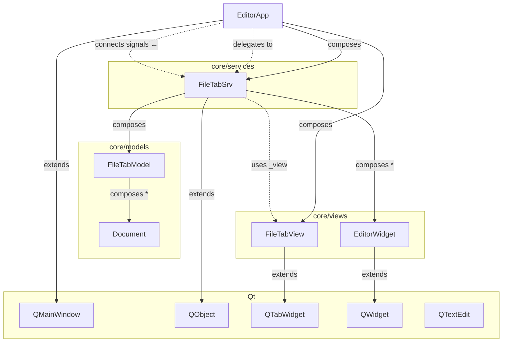

**Пояснение стрелок:**
- `extends` — наследование от Qt
- `composes` — создаёт и владеет
- `composes *` — список (1 ко многим)
- `uses` — получает через параметр
- `delegates` — делегирует вызовы (меню, фокус)
- `connects signals` — сигнал-слот
