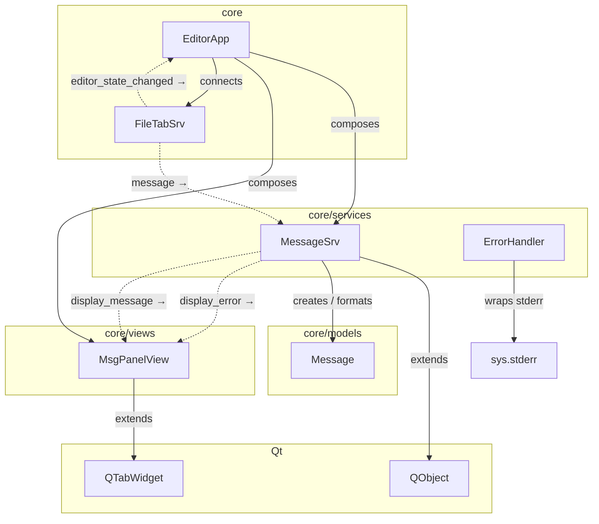

**Пояснение:**
- `extends` — наследование от Qt
- `creates / formats` — MessageSrv создаёт Message, форматирует в HTML
- `display_error/display_message →` — сигналы, connected к MsgPanelView
- `composes` — EditorApp создаёт и владеет (`self.msg_srv`, `self.msg_panel`)
- `message →` — FileTabSrv.message сигнал → MessageSrv.post_message
