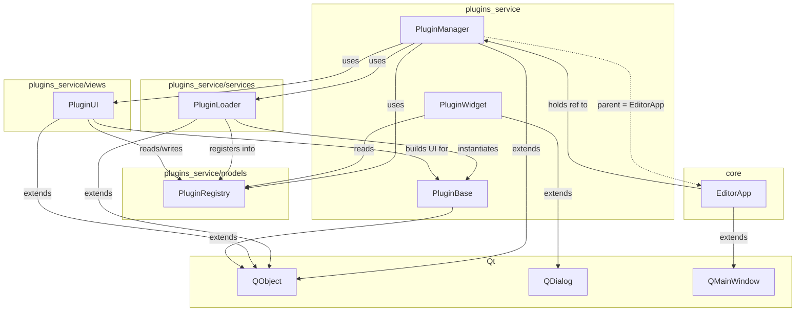

**Пояснение:**
- `extends` — наследование от Qt
- `uses` — получает через конструктор и вызывает методы
- `registers into / reads/writes` — взаимодействует с реестром
- `instantiates` — PluginLoader.load() создаёт экземпляр PluginBase
- `builds UI for` — PluginUI строит UI по конфигурации PluginBase
- `parent` — PluginManager.parent() == EditorApp (QObject parent)
- `holds ref to` — `editor_app.plugin_manager = plugin_manager`
