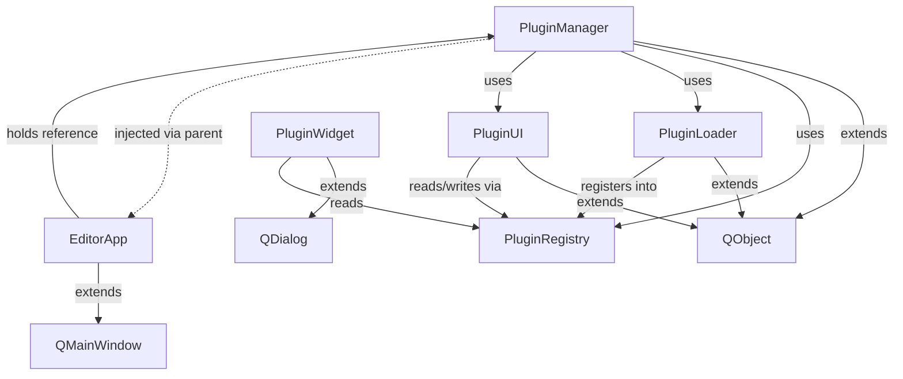

**Пояснение:**
- `extends` — наследование от Qt
- `uses` — получает через конструктор и вызывает методы
- `injected via parent` — PluginManager.parent() == EditorApp
- `registers into / reads` — читает/пишет данные регистрации
- `holds reference` — `editor_app.plugin_manager = plugin_manager`
